<div align="center">

</div>

<br/>

```
$ cat /var/log/saurabh/profile.trace
```

```ini
[00:00:00] PLANNER   → resolve_identity()
[00:00:01] PLANNER   → role      = "AI/ML Developer, Generative AI & Agentic AI"
[00:00:01] PLANNER   → based_in  = "Pune, India"
[00:00:02] PLANNER   → objective = "build agentic systems that don't need babysitting"
[00:00:02] PLANNER   → handoff  ─┐
                                  ▼
[00:00:03] EXECUTOR  → load_stack(genai, ml, backend)
[00:00:04] EXECUTOR  → status    = "in progress, always"
[00:00:04] EXECUTOR  → handoff  ─┐
                                  ▼
[00:00:05] VERIFIER  → check(profile) = PASS
[00:00:05] VERIFIER  → confidence = 0.94
```

<br/>

### manifest.toml

```toml
[genai]
frameworks   = ["LangChain", "LangGraph", "CrewAI"]
models       = ["GPT-4", "Claude", "Gemini"]
practices    = ["RAG", "prompt engineering", "agent orchestration"]

[ml_foundations]
libraries    = ["PyTorch", "scikit-learn", "TensorFlow", "OpenCV"]
origin       = "academic projects → carried into production thinking"

[backend]
language     = "Python"
frameworks   = ["FastAPI"]
infra        = ["AWS", "GCP", "Azure", "Docker", "Kubernetes"]

[currently]
learning     = "multi-agent systems that recover from their own mistakes"
open_to      = "roles where 'agentic' means more than a buzzword"
```

<br/>

<table width="100%">
<tr>
<td width="55%" valign="top">

### trace.log — recent activity

```
● commit stream        watching
● contribution graph    see below
● issue response time   usually same day
```


</td>
<td width="45%" valign="top">

### bench.log — where I compete

```
$ ./run --suite=competitive
```

&nbsp;&nbsp;→ [`leetcode/saurabhmj11`](https://leetcode.com/saurabhmj11/)
&nbsp;&nbsp;→ [`codechef/saurabhmj11`](https://www.codechef.com/users/saurabhmj11)
&nbsp;&nbsp;→ [`hackerrank/saurabhmj11`](https://www.hackerrank.com/saurabhmj11?hr_r=1)

### reach.log — where I answer

```
$ ./ping saurabh --via
```

&nbsp;&nbsp;→ [`mail`](mailto:saurabhmj11@gmail.com) &nbsp;`saurabhmj11@gmail.com`
&nbsp;&nbsp;→ [`web`](https://saurabh-a-lokhande.netlify.app/) &nbsp;`saurabh-a-lokhande.netlify.app`
&nbsp;&nbsp;→ [`linkedin`](https://www.linkedin.com/in/saurabh-lokhande-325041112/) &nbsp;`/in/saurabh-lokhande`

</td>
</tr>
</table>

<br/>

<div align="center">

### contribution_graph.render()

<picture>
  <source media="(prefers-color-scheme: dark)" srcset="https://raw.githubusercontent.com/saurabhmj11/saurabhmj11/output/github-contribution-grid-snake-dark.svg"/>
  
</picture>

</div>

<br/>

```
[00:00:06] VERIFIER  → trace complete. status = 200 OK.
```

<div align="center">
<sub><b>if this trace resolved something useful for you, a ⭐ closes the loop.</b></sub>
</div>

<!--
  SETUP NOTES — remove once configured:

  1) Signature banner (this is the whole point, don't skip it):
     Create a folder `assets/` in your `saurabhmj11/saurabhmj11` repo and
     upload `agent-trace-banner.svg` there. It's a hand-built, fully custom
     animated SVG (pulsing signal traveling Planner → Executor → Verifier,
     glowing name, blinking cursor) — not a template generator. It renders
     natively on GitHub since SVGs embedded via  run their own SMIL
     animations in the browser.

  2) Contribution "snake": add the Platane/snk GitHub Action to the same
     repo, output branch `output`. Optional — the trace-log framing above
     already carries the visual identity even without it.

  3) Design system used throughout, kept consistent everywhere:
     ink background #0B0E14 / panel #11151C, signal amber #F5A623 as the
     single accent, cool cyan #5EEAD4 reserved for "verified/success"
     states only, slate text #C9D1D9. Typeface: monospace throughout
     (JetBrains Mono / Fira Code) — deliberate, since the whole page reads
     as a terminal trace, not a resume with a dark mode skin.

  4) Everything above is real markdown/code-block rendering — no badge
     farms, no rainbow skill-icon rows. The "manifest.toml" and ".log"
     blocks are static text styled as data, which is the signature device:
     structure that means something (this is what an agent-trace actually
     looks like) rather than decoration.
-->
